# snow-crash
Проект для знакомства с основами кибернетической безопасности

> Проект [School21](https://21-school.ru/)


## Краткое описание задачи

Дана виртуальная машина, в которой 15 уровней.
На каждом уровне нужно найти флаг, который является паролем для перехода на следующий уровень.

## Решение

### level00

В полном описании задания была дана подсказка для флага первого уровня. Звучит она так:

```
FIND this first file who can run only as flag00...
```

Не мудрствуя лукаво находим такие файлы
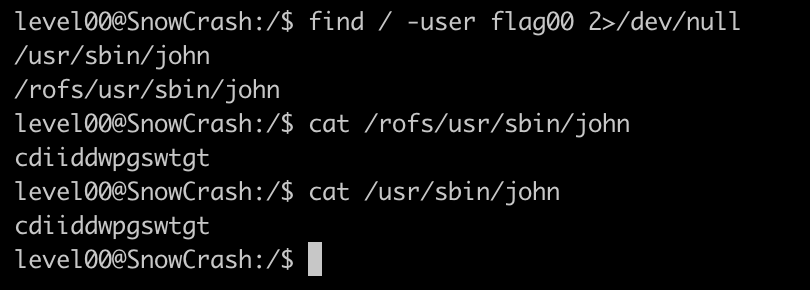

Видим набор букв... явно шифр... очень похож на шифр Цезаря. Привет декодер
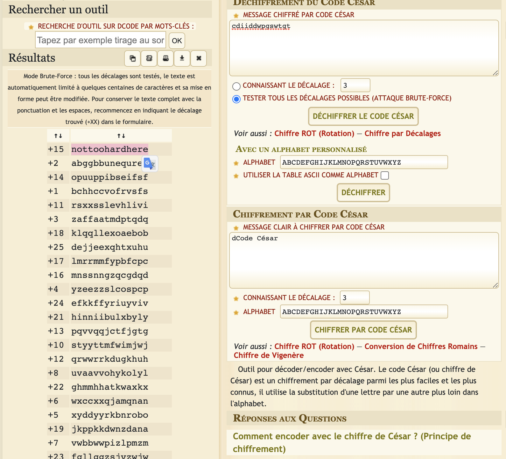

С ключом 15 получился адекватный набор слов `nottoohardhere`, так что берем его

Пароль подходит, переходим дальше
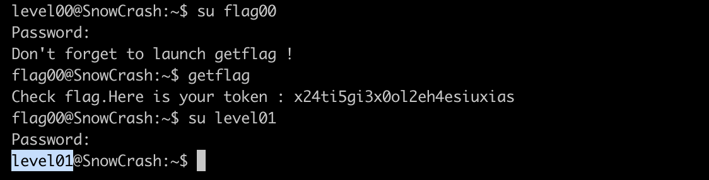

### level01

Итак. Что мы поняли на предыдущем уровне?
Флаги представляют из себя unix пользователя


На текущем уровне ни команда `ls`, ни `find` не дает результатов.
Поэтому я решил заглянуть в файл, где хранятся пароли от всех пользователей `/etc/passwd`.


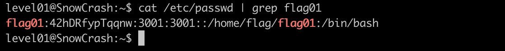

Видим хеш пароля `42hDRfypTqqnwz`.
В описании проекта так же были перечислены утилиты, которые нам могут потребоваться. Среди них утилита __John the Ripper__ (https://github.com/openwall/john)

Сохраняем результат предыдущей команды в отдельный файл на своей машине и спускаем Джона с поводка
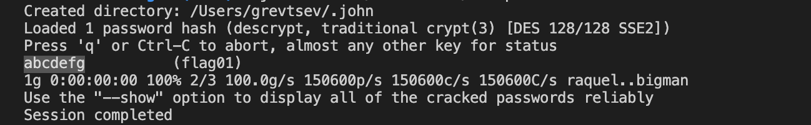

`42hDRfypTqqnw` -> `abcdefg`

Добро пожаловать на level02!

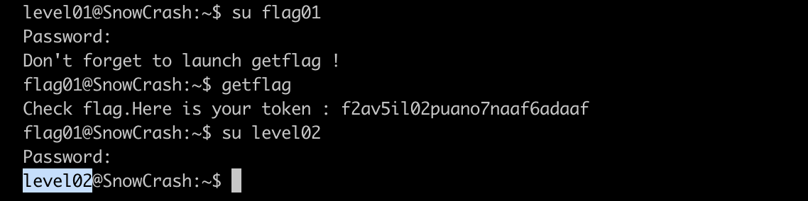

### level02

В этот раз команда `ls` выдает результаты
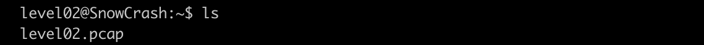

Расширение файла легко гуглится
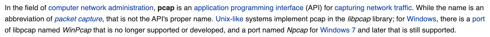

Это tcpdump. Для интерпретации воспользуемся программой WireShark

АГА, это пароль! Только что за точки...
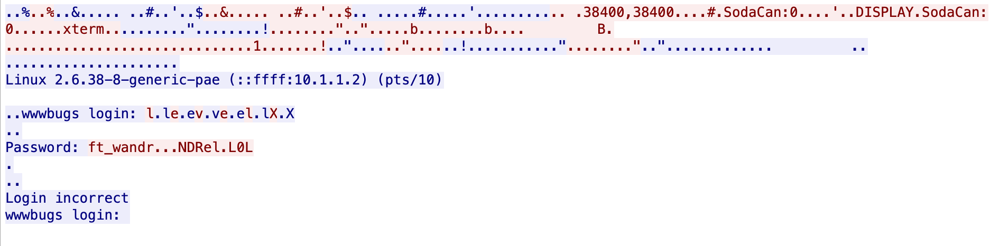

Посмотрим в hex формате
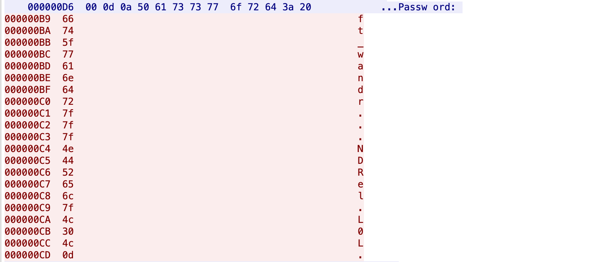

В Ascii-таблице: `7f` - клавиша Del; `0d` - перевод строки

Складываем 1+1. Точка, это нажатие на клавишу Del, а последняя точка, на Enter.


Получаем пароль и более не задерживаемся
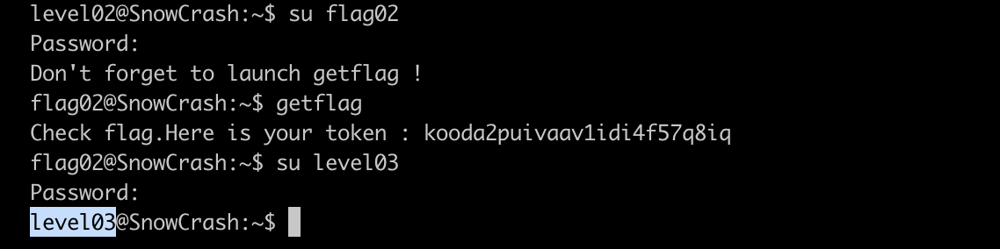

### level03

Посмотрим что у нас есть
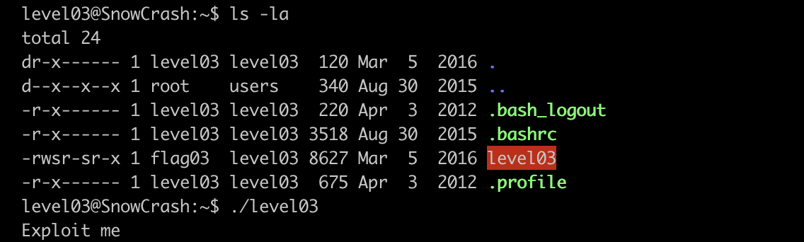

Обратим внимание на права доступа. Во-первых, это файл исполняемый.
Во-вторых, есть атрибут `-s`, который позволяет запустить файл от создавшего его пользователя, а именно `flag03`. Вспоминаем, что пользователь `flag03` позволяет вызвать команду `getflag`. А при запуске `level03` и сам подсказывает, что надо сделать эксплойт.

Посмотрим что происходит в `level03` с помощью команды `ltrace`
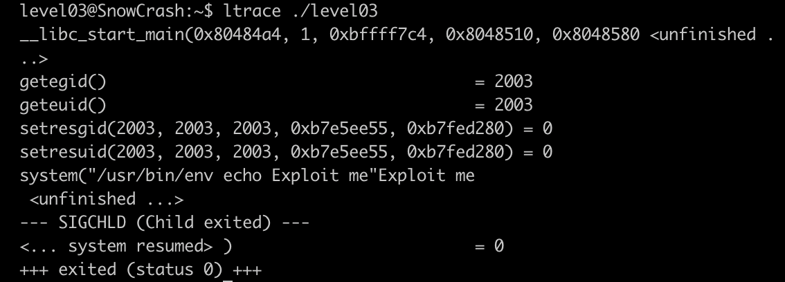

Системный вызов `system()` исполняет указанную команду. Отлично, у нас есть источник для эксплойта. Надо подменить что-то из указанных там програм на наш `getflag`.

Видим вызов `echo` без указания абсолютного пути. Как будет выполняться такая команда?
Будет перебирать пути в переменной окружения PATH слева направо пока не найдет бинарник с именем `echo`.

У нас есть папка, в которой мы можем создавать файлы (`/tmp`).
Устроим проникновение!
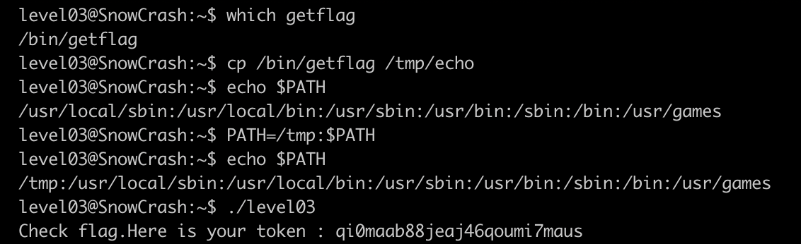

### level04

ls -la
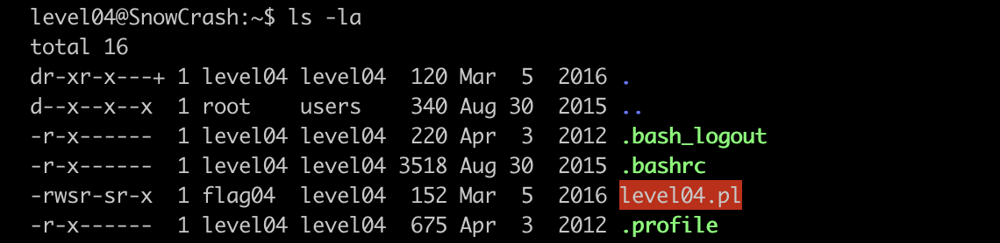

Ситуация такая же. Файл может исполняться от пользователя flag04.
По раcширению `.pl` мы узнаем, что это __perl__ скрипт.


Видим localhost:4747 и библиотеку CGI. Понимаем, что это веб приложение. Причем скрипт никак не защищен от инъекции через параметр `x`.
Воспользуемся этим.
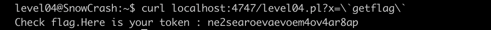

