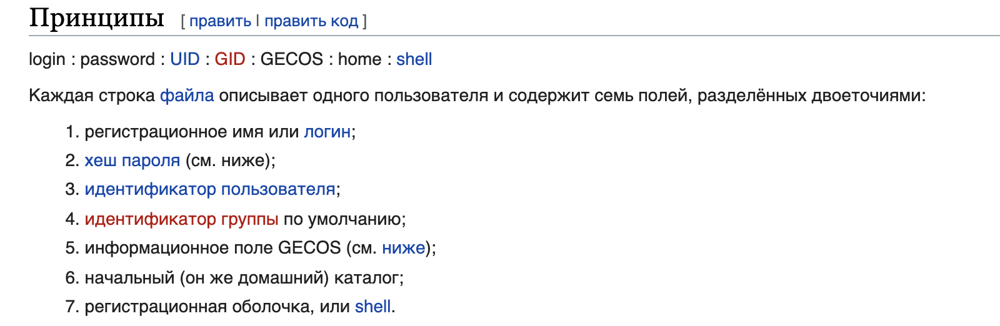

# snow-crash
Проект для знакомства с основами кибернетической безопасности

> Проект [School21](https://21-school.ru/)


## Краткое описание задачи

Дана виртуальная машина, в которой 15 уровней.
На каждом уровне нужно найти флаг, который является паролем для перехода на следующий уровень.

## Решение

### level00

В полном описании задания была дана подсказка для флага первого уровня. Звучит она так:

```
FIND this first file who can run only as flag00...
```

Не мудрствуя лукаво находим такие файлы


Видим набор букв... явно шифр... очень похож на шифр Цезаря. Привет декодер


С ключом 15 получился адекватный набор слов `nottoohardhere`, так что берем его

Пароль подходит, переходим дальше


### level01

Итак. Что мы поняли на предыдущем уровне?
Флаги представляют из себя unix пользователя


На текущем уровне ни команда `ls`, ни `find` не дает результатов.
Поэтому я решил заглянуть в файл, где хранятся пароли от всех пользователей `etc/passwd`.




Видим хеш пароля `42hDRfypTqqnwz`.
В описании проекта так же были перечислены утилиты, которые нам могут потребоваться. Среди них утилита __John the Ripper__ (https://github.com/openwall/john)

Сохраняем результат предыдущей команды в отдельный файл на своей машине и спускаем Джона с поводка


`42hDRfypTqqnw` -> `abcdefg`

Добро пожаловать на level02


### level02

