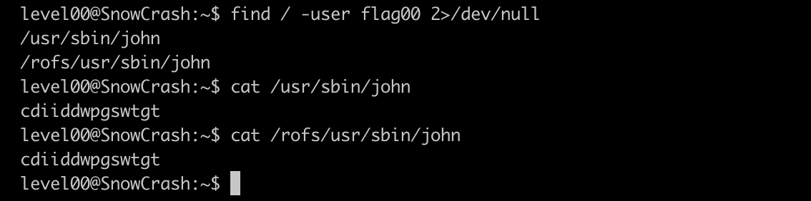

# snow-crash
Проект для знакомства с основами кибернетической безопасности

> Проект [School21](https://21-school.ru/)


## Краткое описание задачи

Дана виртуальная машина, в которой 15 уровней.
На каждом уровне нужно найти флаг, который является паролем для перехода на следующий уровень.

## Решение

### level00

В полном описании задания была дана подсказка для флага первого уровня. Звучит она так:

```
FIND this first file who can run only as flag00...
```

Не мудрствуя лукаво находим такие файлы


Видим набор букв... явно шифр... очень похож на шифр Цезаря. Привет декодер


С ключом 15 получился адекватный набор слов __nottoohardhere__, так что берем его

Пароль подходит, переходим дальше


#### level01
